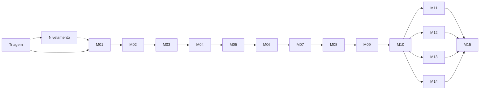

# Mapa de competências

A trilha tem 17 estações: a Triagem, o Nivelamento (só se a Triagem indicar), 10 módulos de núcleo, 4 aprofundamentos e um módulo de integração. A estrutura segue as unidades do Hello Interview, reescritas com nossas palavras ([ADR 0003](../.red/adr/0003-hello-interview-como-estrutura-base.md)). Os objetivos, as Competências e as Unidades de cada módulo ficam no `modulo.md` da pasta do módulo.

## Trilhos

- **Preparação:** Triagem e Nivelamento, antes do M01. Ver [`preparacao/`](preparacao/).
- **Núcleo (M01–M10):** em sequência. Cada módulo começa do Checkpoint de módulo do anterior, e o Projeto prático (encurtador com analytics) evolui a cada etapa.
- **Aprofundamentos (M11–M14):** em qualquer ordem, depois do M10. Usam o Projeto prático quando o tema cabe nele e Labs isolados quando não cabe.
- **Integração (M15):** depois dos quatro aprofundamentos.

## Estações

| ID | Estação | Pergunta do módulo | Depende de | No Projeto prático |
|---|---|---|---|---|
| — | [Triagem](preparacao/triagem.md) | O que você já sabe, e o que precisa aprender antes do M01? | — | — |
| — | [Nivelamento](preparacao/nivelamento.md) | Que ferramentas e fundamentos de infraestrutura faltam para os labs? | Triagem | VM na nuvem com acesso por Tailscale |
| M01 | [Fundamentos e método](M01-fundamentos-e-metodo/modulo.md) | Como transformo uma ideia em requisitos mensuráveis e numa primeira versão que funciona? | Triagem | API + PostgreSQL + base62, medida com k6 |
| M02 | [Dados: modelagem, armazenamento e índices](M02-dados/modulo.md) | Como escolho o modelo de dados e os índices a partir de como os dados são lidos e escritos? | M01 | Esquema de cliques, índices, migração compatível |
| M03 | [Concorrência e contenção](M03-concorrencia-e-contencao/modulo.md) | Como garanto uma regra de negócio quando muita gente age ao mesmo tempo? | M02 | Criação idempotente, teste concorrente |
| M04 | [Escalar leituras: cache e CDN](M04-escalar-leituras/modulo.md) | Quando um cache compensa, e que inconsistência ele traz junto? | M03 | Redis no redirecionamento |
| M05 | [Escala horizontal e rede](M05-escala-horizontal-e-rede/modulo.md) | Como atendo mais tráfego com mais máquinas, e o que muda na rede? | M04 | Várias instâncias atrás de um balanceador |
| M06 | [Replicação e consistência](M06-replicacao-e-consistencia/modulo.md) | Que garantia de consistência a pessoa enxerga quando os dados têm cópias? | M05 | Réplica de leitura |
| M07 | [Assíncrono: filas e eventos](M07-assincrono-filas-e-eventos/modulo.md) | O que tiro do caminho da requisição, e como garanto que nada se perde nem se duplica? | M06 | Analytics por fila |
| M08 | [Proteção: limites, abuso e segurança](M08-protecao-e-seguranca/modulo.md) | Como impeço que o serviço seja abusado ou vire ferramenta de phishing? | M07 | Rate limiter, validação, lista de bloqueio |
| M09 | [Observabilidade e SLO](M09-observabilidade-e-slo/modulo.md) | Como provo, com números, que o sistema está atendendo bem quem usa? | M08 | OpenTelemetry, Grafana, SLO e alertas |
| M10 | [Falhas e resiliência](M10-falhas-e-resiliencia/modulo.md) | O que acontece quando algo quebra, e como o sistema se recupera? | M09 | Falhas injetadas, failover, restauração |
| M11 | [Escalar escritas: particionamento](M11-particionamento/modulo.md) | Como divido dados e escritas entre máquinas sem criar pontos quentes? | M10 | Opcional; Lab isolado de chave quente |
| M12 | [Tempo real e arquivos grandes](M12-tempo-real-e-arquivos-grandes/modulo.md) | Como envio atualizações ao cliente e movo arquivos grandes sem sobrecarregar o servidor? | M10 | Painel de cliques em tempo real |
| M13 | [Busca e dados especializados](M13-busca-e-dados-especializados/modulo.md) | Quando o banco principal não basta, com busca textual, geografia, séries temporais ou ranking, o que muda? | M10 | Ranking dos links mais clicados |
| M14 | [Serviços, fluxos longos e evolução](M14-servicos-e-evolucao/modulo.md) | Quando dividir em serviços, e como coordenar uma operação que atravessa vários deles? | M10 | Decisão, com ADR, sobre separar o analytics |
| M15 | [Integração: cenários mistos e entrevista](M15-integracao/modulo.md) | Consigo decidir uma arquitetura nova, sozinho e com tempo contado? | M11–M14 | Revisão dos ADRs do encurtador |

## O que todo módulo entrega

O **Módulo concluído** exige nível ≥3 em todas as Competências do módulo. Cada `modulo.md` detalha a evidência, sempre composta de:

1. um artefato reproduzível (código, script de carga ou configuração versionada);
2. uma medição ou um teste de falha relevante para o tema;
3. a explicação de duas alternativas e dos limites de cada uma.

As estimativas de tempo por módulo entram na Spec do MVP.
